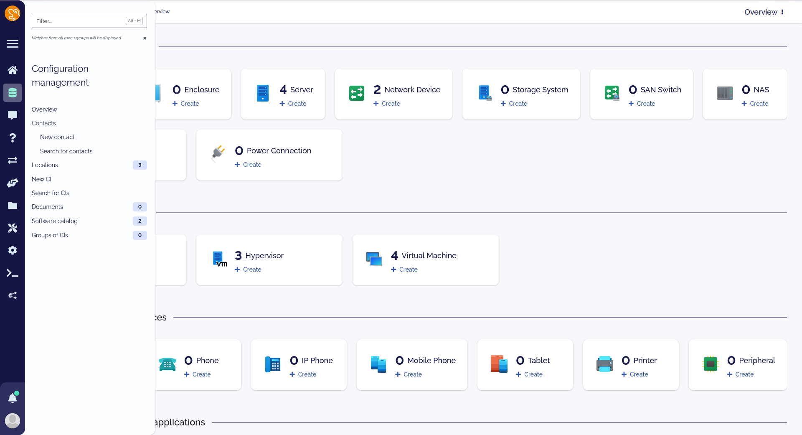
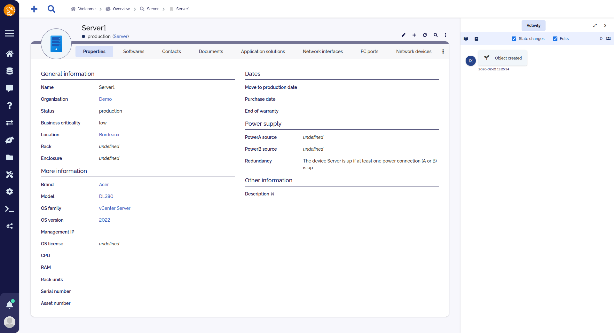
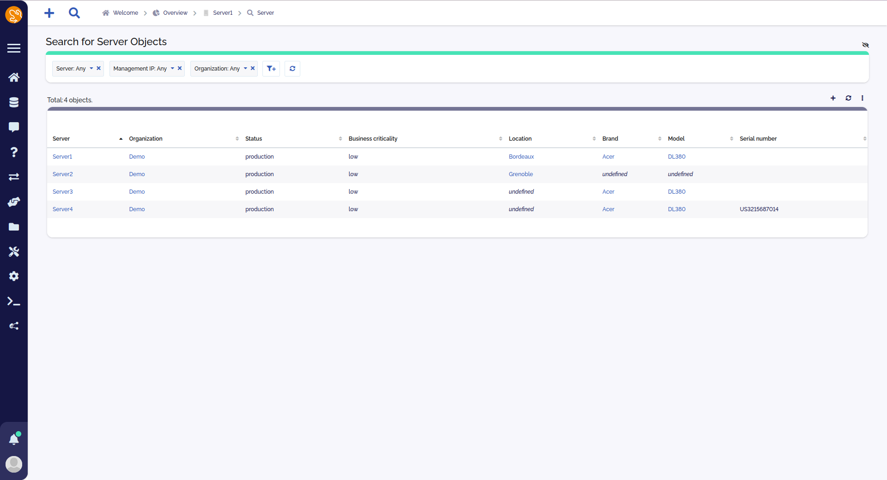

<h2 align="center">
	Bluemoon theme for iTop
</h2>

	
	
	

## Usage

1. If using releases, extract `dist/*` into your extension folder, otherwise extract `steffunky-backoffice-bluemoonr-theme` into your extension folder
2. Run a setup
3. Select `Blue moon` in your preferences

## Gallery

	

	

	

## Contributing

Modify any scss file using iTop variables, then run a setup or a toolkit